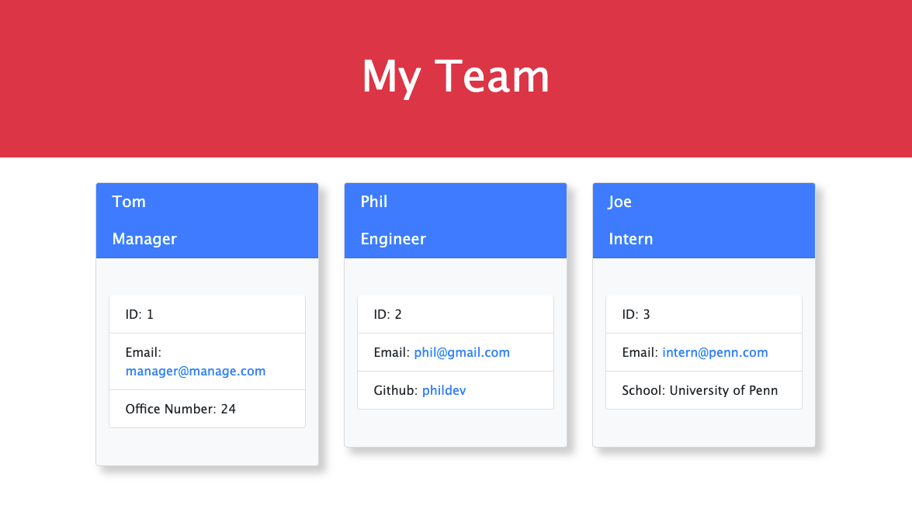

# Team Profile Generator  

  <a href="https://opensource.org/licenses/MIT" alt="License">
        </a>
  
  ## Description
  A Node.js command-line application that takes in information about employees on a software engineering team, then generates an HTML webpage that displays summaries for each person.

  ## Table of Contents
  - [Installation](#installation)
  - [Usage](#usage)
  - [License](#license)
  - [Contributing](#Contributing)
  - [Tests](Test)
  - [Questions](Questions)

  ## Installation
  To install necessary dependencies, run the following command:
   ``` md
   npm i
   ```
  ## Usage
  The page will generate cards for as many engineers and interns as you have. The way the app is currently designed, only on manager may be added for each page generated.





  A short walk-through video for this application can be found [here]('https://drive.google.com/file/d/16dfvD2JhlFxjb6PlLQ6fWEyNDEGOZV7N/view?usp=sharing') 


  ## License
  This project is licensed under the [MIT]('https://opensource.org/licenses/MIT') license.

  ## Contributing
  Please feel free to contact me! See my email and GitHub username below.

  ## Tests
  To run tests, run the following command:

  ``` md
  npm test
  ```
  ## Questions
  If you have any questions about the repo, open an issue or contact me directly at [elconwell@gmail.com](elconwell@gmail.com). You can find more of my work at [shaneconwell](https://github.com/shaneconwell).

  